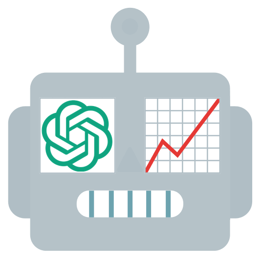

# Robinhood AI Trading Bot
## ⚡ TL;DR
Once you've added your OpenAI API Key and Robinhood credentials, and run this bot in "Auto" mode, it will analyze your portfolio stocks and some of your watchlist stocks (if available). 
It calculates moving averages for these stocks, checks Robinhood analyst ratings (covering what "bulls" and "bears" say), feeds this data to OpenAI, and asks the AI to decide on actions for each stock (sell, buy, or hold, including amount). 
It then directly executes all AI-made decisions.

So be smart — don’t run this bot in "Auto" mode right after your first test. 
This involves real money, and there’s no cancel button! 
Begin with "Demo" mode, which performs everything as in "Auto" mode except the actual sell and buy actions, which are just printed as if executed.

Then, try "Manual" mode, where the bot asks for confirmation before each sell or buy action.

P.S. I still run it in "Auto" mode, and, to be honest, I’m happy with the results so far.


## 🌟 Fun Part
Welcome to the Robinhood Trading Bot! This Python script pairs OpenAI's intelligence with Robinhood's trading power to help you automate and optimize your stock moves.


### Motivation
This is a scientific experiment to see how AI can trade stocks better than humans (or at least me). 


### Features
- **AI-Powered Trading**: Leverages OpenAI to provide smart, data-driven trading decisions.
- **Post-Decision Adjustments**: Refines trading moves based on trade outcomes.
- **Portfolio & Watchlist Integration**: Analyze and trade stocks from both your Robinhood portfolio and watchlist.
- **Customizable Parameters**: Set trading limits and conditions to fit your strategy.
- **Demo Mode**: Safely test trades without real execution.
- **Manual Mode**: Approve each trade individually.
- **Auto Mode**: Automate trades based on AI guidance.
- **Workday Schedule**: Align bot activity with market hours.
- **Logging**: Track bot activity and trade history in the console.


### How It Works
1. **Login to OpenAI**: Authenticates using your OpenAI API key.
2. **Login to Robinhood**: Logs into your Robinhood account with your credentials.
3. **Fetch Portfolio Stocks**: Retrieves stocks from your portfolio.
4. **Fetch Watchlist Stocks**: Retrieves a limited number of stocks from your watchlist, selecting randomly if needed to meet the limit.
5. **Analyze Stock Prices and Ratings**: Calculates moving averages and includes Robinhood analyst ratings.
6. **AI-Powered Decisions**: Sends stock data to OpenAI, receiving trading decisions (sell, buy, or hold) for each stock.
7. **Execute Trades**: Executes initial trading decisions.
8. **Post-Decision Adjustments**: Adjusts trades based on executed outcomes.
9. **Execute Adjusted Trades**: Executes refined trading decisions.
10. **Repeat**: Continues to analyze, trade, and adjust as market conditions evolve.


#### Analyze Stock Prices and Ratings System
The bot's analytical system incorporates moving averages and Robinhood analyst ratings to inform trading decisions:
1. **Moving Averages**: The bot calculates moving averages (50-day and 200-day) for each stock to evaluate price trends and identify optimal buy and sell points.
2. **Robinhood Analyst Ratings**: The bot fetches bullish and bearish ratings from Robinhood for each stock, providing additional insights into market sentiment and potential price movements.

This is Robinhood's analyst rating system example:


#### AI-Powered Decision-Making System
The bot leverages OpenAI to make data-driven trading decisions based on the stock data:
1. **Input Data**: The bot feeds the stock data (moving averages, analyst ratings) to OpenAI.
2. **Output Data**: OpenAI provides trading decisions (sell, buy, or hold) for each stock.

Decision-making AI-prompt example:  
``````
**Decision-Making AI Prompt:**

**Context:**
You are an investment advisor managing a stock portfolio and watchlist. Every 600 seconds, you analyze market conditions to make informed investment decisions.

**Task:**
Analyze the provided portfolio and watchlist data to recommend:
1. Stocks to sell, prioritizing those that maximize buying power and profit potential.
2. Stocks to buy that align with available funds and current market conditions.

**Constraints:**
- Maintain a portfolio size of fewer than 10 stocks.
- Total Buying Power: 3.96 USD initially.
- Sell Amounts Guidelines: Minimum 1.0 USD, Maximum 300.0 USD
- Buy Amounts Guidelines: Minimum 1.0 USD, Maximum 300.0 USD
- Stocks under PDT Limit: NVDA, MSFT, SNAP, NWSA, ...

**Portfolio Overview:**
```json
{
 "AAPL": {
  "price": 227.59,
  "quantity": 0.564172,
  "average_buy_price": 226.93,
  "50_day_mavg_price": 226.88,
  "200_day_mavg_price": 202.76,
  "robinhood_analyst_sell_opinion": "Regulators have a keen eye on Apple, and recent regulations have chipped away at parts of Apple\u2019s sticky ecosystem. ",
  "robinhood_analyst_buy_opinion": "Apple has a stellar balance sheet and sends great amounts of cash flow back to shareholders.",
  "robinhood_analyst_summary_distribution": "sell: 6%, buy: 67%, hold: 27%"
 },
 "NVDA": {
  "price": 147.13,
  "quantity": 0.000302,
  "average_buy_price": 147.19,
  "50_day_mavg_price": 126.67,
  "200_day_mavg_price": 106.37,
  "robinhood_analyst_sell_opinion": "Nvidia\u2019s gaming GPU business has often seen boom-or-bust cycles based on PC demand and, more recently, cryptocurrency mining.",
  "robinhood_analyst_buy_opinion": "The firm has a first-mover advantage in the autonomous driving market that could lead to widespread adoption of its Drive PX self-driving platform.",
  "robinhood_analyst_summary_distribution": "sell: 0%, buy: 92%, hold: 8%"
 },
 ...
}
```

**Watchlist Overview:**
```json
{
 "TCEHY": {
  "price": 53.05,
  "50_day_mavg_price": 52.99,
  "200_day_mavg_price": 45.76,
  "robinhood_analyst_sell_opinion": "The possibility of highly competitive foreign internet service providers reentering China over the next 10-20 years.",
  "robinhood_analyst_buy_opinion": "Compliance costs can rise to a point where they become significant barriers to entry to the Chinese internet industry.",
  "robinhood_analyst_summary_distribution": "sell: 3%, buy: 95%, hold: 2%"
 },
 "NSSC": {
  "price": 39.1,
  "50_day_mavg_price": 39.5,
  "200_day_mavg_price": 44.88,
  "robinhood_analyst_summary_distribution": "sell: 0%, buy: 83%, hold: 17%"
 },
 ...
}
```

**Response Format:**
Return your decisions in a JSON array with this structure:
```json
[
  {"symbol": "<symbol>", "decision": "<decision>", "quantity": <quantity>},
  ...
]
```
- `symbol`: Stock ticker symbol.
- `decision`: One of `buy`, `sell`, or `hold`.
- `quantity`: Recommended transaction quantity.

**Instructions:**
- Provide only the JSON output with no additional text.
- Return an empty array if no actions are necessary.
``````

AI-response example:
```
[
    {"symbol": "AAPL", "decision": "sell", "quantity": 0.564172},
    {"symbol": "BL", "decision": "hold", "quantity": 0.0},
    {"symbol": "EQIX", "decision": "buy", "quantity": 1.0},
    ...
]
```


#### AI-Powered Post-Decision Adjustments System
The bot adjusts its trading decisions based on the outcomes of executed trades:
1. **Input Data**: The bot feeds the executed trades data to OpenAI.
2. **Output Data**: OpenAI provides adjustments to the trading decisions based on the trading results.

Post-decision adjustments AI-prompt example:  
``````
**Post-Decision Adjustments AI Prompt:**

**Context:**
You are an investment advisor tasked with reviewing and adjusting prior trading decisions. Your goal is to optimize buying power and profit potential by analyzing trading results and making necessary changes.

**Task:**
1. Review previous trading outcomes and resolve any errors.
2. Reorder and adjust sell decisions to enhance buying power.
3. Update buy recommendations based on the newly available buying power.

**Constraints:**
- Maintain a portfolio size of fewer than 10 stocks.
- Total Buying Power: 2.95 USD initially.
- Sell Amounts Guidelines: Minimum 1.0 USD, Maximum 300.0 USD
- Buy Amounts Guidelines: Minimum 1.0 USD, Maximum 300.0 USD
- Stocks under PDT Limit: NVDA, MSFT, SNAP, NWSA, ...

**Trading Results:**
```json
{
 "AAPL": {
  "symbol": "AAPL",
  "amount": 1.0,
  "decision": "sell",
  "result": "success",
  "details": {
   "quantity": 0.004394,
   "price": null
  }
 },
 "NVDA": {
  "symbol": "NVDA",
  "amount": 1.0,
  "decision": "sell",
  "result": "error",
  "details": "Not enough shares to sell."
 },
 ...
}
```

**Response Format:**
Return your decisions in a JSON array with this structure:
```json
[
  {"symbol": "<symbol>", "decision": "<decision>", "quantity": <quantity>},
  ...
]
```
- `symbol`: Stock ticker symbol.
- `decision`: One of `buy`, `sell`, or `hold`.
- `quantity`: Recommended transaction quantity.

**Instructions:**
- Provide only the JSON output with no additional text.
- Return an empty array if no actions are necessary.
``````

AI-response example:
```
[
    {"symbol": "AAPL", "decision": "sell", "quantity": 0.004394},
    ...
]
```


#### Logging System
The bot logs its activity and trading decisions in a console log.
Log example:
```
Are you sure you want to run the bot in auto mode? (yes/no): yes
[2024-11-01 11:06:58] [INFO]    Market is open, running trading bot in auto mode...
[2024-11-01 11:06:58] [INFO]    Getting portfolio stocks...
[2024-11-01 11:07:02] [INFO]    Portfolio stocks to proceed: NVDA (1.07%), MSFT (0.12%), SNAP (0.25%), NWSA (13.71%), ...
[2024-11-01 11:07:02] [INFO]    Prepare portfolio stocks for AI analysis...
[2024-11-01 11:07:07] [INFO]    Getting watchlist stocks...
[2024-11-01 11:07:08] [INFO]    Watchlist stocks to proceed: VRT, BB, VRNT, PBI, BMBL, IESC, WB, LITE, ...
[2024-11-01 11:07:08] [INFO]    Prepare watchlist overview for AI analysis...
[2024-11-01 11:07:09] [INFO]    Making AI-based decision...
[2024-11-01 11:07:21] [INFO]    Executing decisions...
[2024-11-01 11:07:21] [INFO]    NVDA > Decision: sell of 2.012
[2024-11-01 11:07:21] [ERROR]   NVDA > Sold 2.012 stocks
[2024-11-01 11:07:21] [INFO]    MSFT > Decision: sell of 1.5422
[2024-11-01 11:07:21] [ERROR]   MSFT > Error selling: Not enough shares to sell.
[2024-11-01 11:07:22] [INFO]    VRT > Decision: buy of 2.09
[2024-11-01 11:07:23] [INFO]    VRT > Bought 2.09 stocks
[2024-11-01 11:07:23] [INFO]    SNAP > Decision: hold of 0.0323
[2024-11-01 11:07:23] [INFO]    VIAV > Decision: hold of 0.0212
[2024-11-01 11:07:23] [INFO]    Making AI-based post-decision analysis, attempt: 1/2...
[2024-11-01 11:07:24] [INFO]    Stocks sold: NVDA (2.0)
[2024-11-01 11:07:24] [INFO]    Stocks bought: VRT (2.09)
[2024-11-01 11:07:24] [INFO]    Errors: MSFT (Not enough shares to sell.)
[2024-11-01 11:07:24] [INFO]    Waiting for 600 seconds...
```


## 🥱 Boring Part
### Install
1. Clone the repository:
    ```sh
    git clone https://github.com/siropkin/robinhood-ai-trading-bot.git
    cd robinhood-ai-trading-bot
    ```

2. Install dependencies:
    ```sh
    pip install robin_stocks openai pandas
    ```


### Config
Clone `config.py.example` to `config.py` and fill in the required parameters:
   ```sh
   cp config.py.example config.py
   ```

Configuration parameters:
```python
# Credentials
OPENAI_API_KEY = "..."                      # OpenAI API key
ROBINHOOD_USERNAME = "..."                  # Robinhood username
ROBINHOOD_PASSWORD = "..."                  # Robinhood password

# Basic config parameters
MODE = "demo"                               # Trading mode (demo, auto, manual)
LOG_LEVEL = "INFO"                          # Log level (DEBUG, INFO)
RUN_INTERVAL_SECONDS = 600                  # Trading interval in seconds (if the market is open)

# Robinhood config parameters
WATCHLIST_NAMES = []                        # Watchlist names (can be empty, or "My First List", "My Second List", etc.)
WATCHLIST_OVERVIEW_LIMIT = 10               # Number of stocks to process in decision-making (e.g. 20)
PORTFOLIO_LIMIT = 10                        # Number of stocks to hold in the portfolio

# OpenAI config params
OPENAI_MODEL_NAME = "gpt-4o-mini"           # OpenAI model name
MAX_POST_DECISIONS_ADJUSTMENTS = False      # Maximum number of adjustments to make (False - disable adjustments)

# Trading parameters
MIN_SELLING_AMOUNT_USD = 1.0                # Minimum sell amount in USD (False - disable setting)
MAX_SELLING_AMOUNT_USD = 10.0               # Maximum sell amount in USD (False - disable setting)
MIN_BUYING_AMOUNT_USD = 1.0                 # Minimum buy amount in USD (False - disable setting)
MAX_BUYING_AMOUNT_USD = 10.0                # Maximum buy amount in USD (False - disable setting)
PDT_PROTECTION = True                       # Pattern day trader protection (False - disable protection). See: https://robinhood.com/us/en/support/articles/pattern-day-trade-protection/
```

### Run
To start the bot, run the following command in your terminal:
   ```sh
   python main.py
   ```


## ⚠️ Disclaimer
This bot is for educational purposes only. Trading stocks involves risk, and you should only trade with money you can afford to lose. The author is not responsible for any financial losses you may incur.


## 📄 License
This project is licensed under the MIT License. See the [LICENSE](LICENSE) file for details.


## 🤝 Contributing
I'm genuinely excited to welcome contributors! 
Whether you're interested in refining the logging system, enhancing AI-prompt strategies, or enriching stock data — there’s room for your ideas and expertise. 
Feel free to submit pull requests or open issues with suggestions and improvements!


## 📧 Contact
If you have any questions or feedback, feel free to reach out at [goodbotty@proton.me](mailto:goodbotty@proton.me).
