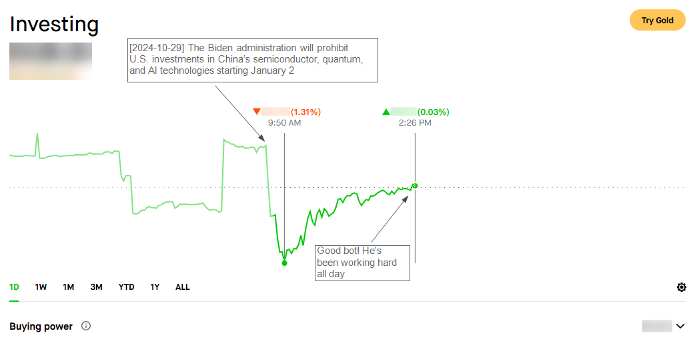

Fuck, fuck, fuck, motherfuck,<br />
Rollin' stocks, makin' trades,<br />
Time to cash in, watch those gains


# 🤖 Robinhood AI Trading Bot
## ⚡ TL;DR
Once you've added your OpenAI API Key and Robinhood credentials, and run this bot in "Auto" mode, it will analyze your portfolio stocks and some of your watchlist stocks (if available). 
It calculates moving averages for these stocks, checks Robinhood analyst ratings (covering what "bulls" and "bears" say), feeds this data to OpenAI, and asks the AI to decide on actions for each stock (sell, buy, or hold, including quantities). 
It then directly executes all AI-made decisions.

So be smart — don’t run this bot in "Auto" mode right after your first test. 
This involves real money, and there’s no cancel button! 
Begin with "Demo" mode, which performs everything as in "Auto" mode except the actual sell and buy actions, which are just printed as if executed.

Then, try "Manual" mode, where the bot asks for confirmation before each sell or buy action.

P.S. I still run it in "Auto" mode, and, to be honest, I’m happy with the results so far.


## 🌟 Fun Part
Welcome to the Robinhood Trading Bot! This Python script pairs OpenAI's intelligence with Robinhood's trading power to help you automate and optimize your stock moves.


### Motivation
This is a scientific experiment to see how AI can trade stocks better than humans (or at least me). 


### Features
- **AI-Powered Trading**: Leverages OpenAI to provide smart, data-driven trading decisions.
- **Post-Decision Adjustments**: Refines trading moves based on trade outcomes.
- **Portfolio & Watchlist Integration**: Analyze and trade stocks from both your Robinhood portfolio and watchlist.
- **Customizable Parameters**: Set trading limits and conditions to fit your strategy.
- **Demo Mode**: Safely test trades without real execution.
- **Manual Mode**: Approve each trade individually.
- **Auto Mode**: Automate trades based on AI guidance.
- **Workday Schedule**: Align bot activity with market hours (alpha version).
- **Logging**: Track bot activity and trade history in the console.


### How It Works
1. **Login to OpenAI**: Authenticates using your OpenAI API key.
2. **Login to Robinhood**: Logs into your Robinhood account with your credentials.
3. **Fetch Portfolio Stocks**: Retrieves stocks from your portfolio.
4. **Fetch Watchlist Stocks**: Retrieves a limited number of stocks from your watchlist, selecting randomly if needed to meet the limit.
5. **Analyze Stock Prices and Ratings**: Calculates moving averages and includes Robinhood analyst ratings.
6. **AI-Powered Decisions**: Sends stock data to OpenAI, receiving trading decisions (sell, buy, or hold) for each stock.
7. **Execute Trades**: Executes initial trading decisions.
8. **Post-Decision Adjustments**: Adjusts trades based on executed outcomes.
9. **Execute Adjusted Trades**: Executes refined trading decisions.
10. **Repeat**: Continues to analyze, trade, and adjust as market conditions evolve.


#### Analyze Stock Prices and Ratings System
The bot's analytical system incorporates moving averages and Robinhood analyst ratings to inform trading decisions:
1. **Moving Averages**: The bot calculates moving averages (50-day and 200-day) for each stock to evaluate price trends and identify optimal buy and sell points.
2. **Robinhood Analyst Ratings**: The bot fetches bullish and bearish ratings from Robinhood for each stock, providing additional insights into market sentiment and potential price movements.

This is Robinhood's analyst rating system example:


#### AI-Powered Decision-Making System
The bot leverages OpenAI to make data-driven trading decisions based on the stock data:
1. **Input Data**: The bot feeds the stock data (moving averages, analyst ratings) to OpenAI.
2. **Output Data**: OpenAI provides trading decisions (sell, buy, or hold) for each stock.

Decision-making AI-prompt example:  
```
Analyze the stock portfolio and watchlist to make investment decisions. Suggest which stocks to sell first from the portfolio to increase buying power, and then determine if any stock from either the portfolio or the watchlist is worth buying. Return sell decisions in the order they should be executed to maximize buying power, and then provide buy decisions based on the resulting buying power.

Portfolio overview:
{
  "AAPL": {
    "price": "232.310000",
    "quantity": "0.00000100",
    "average_buy_price": "229.3259",
    "equity": "0.00",
    "percent_change": "1.30",
    "intraday_percent_change": "0.00",
    "equity_change": "0.000003",
    "pe_ratio": "35.233500",
    "percentage": "0.00",
    "50_day_mavg": 226.95,
    "200_day_mavg": 201.3,
    "analyst_rating_sell_text": "Regulators have a keen eye on Apple, and recent regulations have chipped away at parts of Apple\u2019s sticky ecosystem. ",
    "analyst_rating_buy_text": "Apple has a stellar balance sheet and sends great amounts of cash flow back to shareholders.",
    "analyst_rating_summary": "Buy: 66%, Sell: 6%, Hold: 28%"
  },
  ...
}

Watchlist overview:
{
  "EQIX": {
    "price": 912.62,
    "50_day_mavg": 863.13,
    "200_day_mavg": 814.06,
    "analyst_rating_sell_text": "Power constraints in key markets will threaten Equinix\u2019s ability to accommodate new tenants and will dampen returns on new developments.",
    "analyst_rating_buy_text": "Equinix is positioned globally to benefit from growing data consumption in international and emerging markets. ",
    "analyst_rating_summary": "Buy: 79%, Sell: 0%, Hold: 21%"
  },
  "MSN": {
    "price": 0.5101,
    "50_day_mavg": 0.48,
    "200_day_mavg": 0.52
  },
  ...
}

Total buying power: $1.51.

Guidelines for buy/sell amounts:
- Min sell: $1.0
- Max sell: $150.0
- Min buy: $1.0
- Max buy: $150.0

Provide a JSON response in this format:
[{"stock_symbol": "<symbol>", "decision": "<decision>", "amount": <amount>}, ...]
Decision options: buy, sell, hold
Amount is the suggested amount to buy or sell in $
Return only the JSON array, without explanation or extra text. If no decisions are made, return an empty array.
```

AI-response example:
```
[
    {"stock_symbol": "AAPL", "decision": "sell", "amount": 1.0},
    {"stock_symbol": "EQIX", "decision": "buy", "amount": 1.0},
    ...
]
```


#### AI-Powered Post-Decision Adjustments System
The bot adjusts its trading decisions based on the outcomes of executed trades:
1. **Input Data**: The bot feeds the executed trades data to OpenAI.
2. **Output Data**: OpenAI provides adjustments to the trading decisions based on the trading results.

Post-decision adjustments AI-prompt example:  
```
Analyze the trading results based on your previous decisions. Make adjustments if needed. Return sell decisions in the order they should be executed to maximize buying power, and then provide buy decisions based on the resulting buying power.

Trading results:
{
  "AAPL": {
    "stock_symbol": "AAPL",
    "amount": 1.0,
    "decision": "sell",
    "result": "success",
    "details": "Demo mode"
  },
  ...
}

Total buying power: $1.51.

Guidelines for buy/sell amounts:
- Min sell: $1.0
- Max sell: $150.0
- Min buy: $1.0
- Max buy: $150.0

Provide a JSON response in this format:
[{"stock_symbol": "<symbol>", "decision": "<decision>", "amount": <amount>}, ...]
Decision options: buy, sell, hold
Amount is the suggested amount to buy or sell in $
Return only the JSON array, without explanation or extra text. If no decisions are made, return an empty array.
```

AI-response example:
```
[
    {"stock_symbol": "AAPL", "decision": "buy", "amount": 1.51}
]
```


#### Logging System
The bot logs its activity and trading decisions in a console log.
Log example:
```
[2024-10-29 09:23:45.961621]  Running trading bot in demo mode...
[2024-10-29 09:23:45.961621]  Getting my stocks to proceed...
[2024-10-29 09:23:50.899339]  Total stocks in portfolio: 27
[2024-10-29 09:23:50.899339]  Prepare portfolio overview for AI analysis...
[2024-10-29 09:23:54.968614]  Getting watchlist stocks to proceed...
[2024-10-29 09:23:55.715594]  Total watchlist stocks: 611
[2024-10-29 09:23:55.715594]  Limiting watchlist stocks to overview limit of 10 (random selection)...
[2024-10-29 09:23:55.716594]  Prepare watchlist overview for AI analysis...
[2024-10-29 09:23:57.108410]  Making AI-based decision...
[2024-10-29 09:23:59.233363]  Total decisions: 4
[2024-10-29 09:23:59.233363]  Executing decisions...
[2024-10-29 09:23:59.233363]  NVDA > Decision: sell with amount $1.0
[2024-10-29 09:23:59.233363]  NVDA > Demo > Sold $1.0 worth of stock
[2024-10-29 09:23:59.233363]  AMZN > Decision: sell with amount $1.0
[2024-10-29 09:23:59.233363]  AMZN > Demo > Sold $1.0 worth of stock
[2024-10-29 09:23:59.233363]  META > Decision: sell with amount $1.0
[2024-10-29 09:23:59.233363]  META > Demo > Sold $1.0 worth of stock
[2024-10-29 09:23:59.233363]  BIDU > Decision: buy with amount $1.0
[2024-10-29 09:23:59.233363]  BIDU > Demo > Bought $1.0 worth of stock
[2024-10-29 09:23:59.233363]  Making AI-based post-decision analysis...
[2024-10-29 09:24:00.189761]  Total post-decision adjustments: 1
[2024-10-29 09:24:00.189761]  Executing decisions...
[2024-10-29 09:24:00.189761]  BIDU > Decision: sell with amount $1.51
[2024-10-29 09:24:00.189761]  BIDU > Demo > Sold $1.51 worth of stock
[2024-10-29 09:24:00.189761]  Making AI-based post-decision analysis...
[2024-10-29 09:24:01.760035]  Total post-decision adjustments: 1
[2024-10-29 09:24:01.760035]  Executing decisions...
[2024-10-29 09:24:01.760035]  BIDU > Decision: sell with amount $1.51
[2024-10-29 09:24:01.760035]  BIDU > Demo > Sold $1.51 worth of stock
[2024-10-29 09:24:01.760035]  Total sold: $4.51, Total bought: $0
[2024-10-29 09:24:01.760035]  Waiting for 600 seconds...
```


## 🥱 Boring Part
### Install
1. Clone the repository:
    ```sh
    git clone https://github.com/siropkin/robinhood-ai-trading-bot.git
    cd robinhood-ai-trading-bot
    ```

2. Install dependencies:
    ```sh
    pip install robin_stocks openai pandas numpy
    ```


### Config
Clone `config.py.example` to `config.py` and fill in the required parameters:
   ```sh
   cp config.py.example config.py
   ```

Configuration parameters:
```python
# Credentials
OPENAI_API_KEY = "..."                      # OpenAI API key
ROBINHOOD_USERNAME = "..."                  # Robinhood username
ROBINHOOD_PASSWORD = "..."                  # Robinhood password

# Basic config parameters
MODE = "demo"                               # Trading mode (demo, auto, manual)
RUN_ON_WORKDAYS_ONLY = True                 # Run bot only on workdays
RUN_INTERVAL_SECONDS = 600                  # Trading interval in seconds

# Robinhood config parameters
WATCHLIST_NAMES = []                        # Watchlist names (can be empty, or "My First List", "My Second List", etc.)
WATCHLIST_OVERVIEW_LIMIT = 10               # Number of stocks to process in decision-making (e.g. 20)
MIN_API_CALL_PAUSE_MS = 500                 # Minimum pause between Robinhood API calls in milliseconds (to avoid rate limits)
MAX_API_CALL_PAUSE_MS = 1500                # Maximum pause between Robinhood API calls in milliseconds (to avoid rate limits)

# OpenAI config params
MAX_POST_DECISION_ADJUSTMENTS = 1           # Maximum number of adjustments to make (0 - disable adjustments)
OPENAI_MODEL_NAME = "gpt-4o-mini"           # OpenAI model name

# Trading parameters
MIN_SELLING_AMOUNT_USD = 1.0                # Minimum sell amount in USD
MAX_SELLING_AMOUNT_USD = 10.0               # Maximum sell amount in USD
MIN_BUYING_AMOUNT_USD = 1.0                 # Minimum buy amount in USD
MAX_BUYING_AMOUNT_USD = 10.0                # Maximum buy amount in USD
```

### Run
To start the bot, run the following command in your terminal:
   ```sh
   python main.py
   ```


## ⚠️ Disclaimer
This bot is for educational purposes only. Trading stocks involves risk, and you should only trade with money you can afford to lose. The author is not responsible for any financial losses you may incur.


## 📄 License
This project is licensed under the MIT License. See the [LICENSE](LICENSE) file for details.


## 🤝 Contributing
I'm genuinely excited to welcome contributors! 
Whether you're interested in refining the logging system, enhancing AI-prompt strategies, or enriching stock data — there’s room for your ideas and expertise. 
Feel free to submit pull requests or open issues with suggestions and improvements!


## 📧 Contact
If you have any questions or feedback, feel free to reach out at [ivan.seredkin@gmail.com](mailto:ivan.seredkin@gmail.com).


## 📢 One Day In The Life Of The Good Bot
[2024-10-29] The Biden administration will prohibit U.S. investments in China’s semiconductor, quantum, and AI technologies starting January 2


